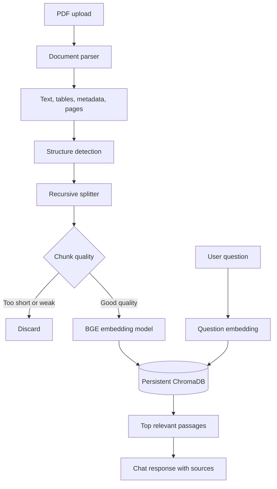

# DocuChat AI

> A private, local workspace for asking questions about your PDF documents.

DocuChat AI lets you upload a PDF, extract and organize its content, create semantic embeddings, and search the most relevant passages from a chat interface.

The application runs locally. Documents and embeddings are stored on your machine using **ChromaDB**.

## What It Does

1. Upload a PDF from the web interface.
2. Parse text, page numbers, metadata, headings, and table-like content.
3. Split the content into overlapping chunks.
4. Remove chunks that are too short or low quality.
5. Generate embeddings with `BAAI/bge-small-en-v1.5`.
6. Store the chunks and embeddings in persistent ChromaDB storage.
7. Retrieve the most relevant passages when you ask a question.
8. Display the answer together with source file names and page numbers.

## Processing Pipeline



## Features

- Document library in the sidebar
- PDF upload with indexing progress
- Document selection for focused searching
- Suggested questions for new conversations
- Loading and error states
- Retrieved source passages with page references
- Responsive layout for desktop and mobile screens

## Technology Stack

| Layer | Technology |
| --- | --- |
| Frontend | Next.js, React, TypeScript, Tailwind CSS, Lucide React |
| Backend | FastAPI, Python |
| PDF parsing | PyMuPDF |
| Chunking | Custom recursive character splitter |
| Embeddings | Hugging Face `BAAI/bge-small-en-v1.5` |
| Vector database | ChromaDB PersistentClient |

## Project Structure

```text
DocuChat-AI/
├── backend/
│   ├── main.py             # FastAPI application and API routes
│   ├── parser.py           # PDF parsing and structure detection
│   ├── chunker.py          # Chunking and quality filtering
│   ├── embedding.py        # Cached embedding model
│   ├── requirements.txt    # Python dependencies
│   ├── uploads/            # Uploaded PDFs
│   ├── chroma_db/          # Generated persistent vector database
│   └── documents.json      # Generated document metadata
└── frontend/
    ├── src/app/page.tsx    # Main document chat interface
    ├── src/app/globals.css # Application styles
    └── package.json        # Frontend dependencies and scripts
```

## Requirements

- Python 3.12 or newer
- Node.js 20 or newer
- npm
- Internet access on the first run to download packages and the embedding model
- Several GB of free disk space for PyTorch and model files

## Quick Start

### 1. Start the backend

From the repository root, open a PowerShell terminal:

```powershell
cd backend
python -m venv venv
.\venv\Scripts\Activate.ps1
python -m pip install -r requirements.txt
uvicorn main:app --reload
```

The API runs at `http://localhost:8000`.

### Production deployment on Render

Use the included `render.yaml` Blueprint, or set the Render service start command to:

```bash
uvicorn main:app --host 0.0.0.0 --port $PORT
```

Render requires the service to bind to `0.0.0.0` and to use its `$PORT` value. The local filesystem persistence used by this project is suitable for a single-instance demo only; configure durable external storage before treating the deployment as production-ready.

### 2. Start the frontend

Open a second PowerShell terminal:

```powershell
cd frontend
npm install
npm run dev
```

Open `http://localhost:3000` in your browser.

The frontend uses `NEXT_PUBLIC_API_URL` when provided. Otherwise, it connects to `http://localhost:8000`.

### 3. Use the application

1. Click **Add document**.
2. Choose a text-based PDF.
3. Wait for indexing to finish.
4. Ask a question in the chat box.
5. Review the returned passages and source pages.

## Embedding and Chunking Settings

The current chunker uses:

- Chunk size: `1,000` characters
- Overlap: `200` characters
- Minimum quality threshold: `40` characters and `7` words
- Table-like blocks: retained even when short
- Embedding device: CPU
- Embedding dimension: `384`

These values are defined in [chunker.py](backend/chunker.py) and [embedding.py](backend/embedding.py).

## API Reference

### Health check

```http
GET /
```

### List indexed documents

```http
GET /documents
```

Returns document names, page counts, character counts, and stored chunk counts.

### Upload a PDF

```http
POST /upload
Content-Type: multipart/form-data
```

The multipart field must be named `file`.

PowerShell example:

```powershell
curl.exe -X POST http://localhost:8000/upload -F "file=@backend/uploads/Safetymanual.pdf"
```

### Ask a question

```http
POST /chat
Content-Type: application/json
```

Request body:

```json
{
  "question": "What are the key safety requirements?",
  "document_id": "optional-document-id"
}
```

The response includes the most relevant passages and their source file names and page numbers.

## Persistence

Embeddings are persisted instead of being kept only in application memory:

- Vector embeddings and chunks are stored in `backend/chroma_db`.
- Document display metadata is stored in `backend/documents.json`.
- Both paths are generated automatically and ignored by git.
- Restarting FastAPI reloads the existing Chroma collection.

To reset the local index, stop the backend and remove the generated paths:

```powershell
Remove-Item -Recurse -Force backend/chroma_db
Remove-Item -Force backend/documents.json
```

## Current Retrieval Behavior

The current version is a semantic retrieval system. It returns relevant passages found in your documents rather than calling a hosted generative language model.

This keeps the project local and makes the returned source context easy to inspect. A generative LLM can be added later to summarize the retrieved passages into a more conversational answer.

## Troubleshooting

### `ModuleNotFoundError` in Python

Make sure the backend virtual environment is activated:

```powershell
cd backend
.\venv\Scripts\Activate.ps1
python -m pip install -r requirements.txt
```

### `Can't resolve 'lucide-react'`

Install the package from the `frontend` directory:

```powershell
cd frontend
npm install lucide-react
```

### Frontend says the backend is offline

Start the API in a separate terminal:

```powershell
cd backend
.\venv\Scripts\Activate.ps1
uvicorn main:app --reload
```

### PDF has no usable text

The current parser supports text-based PDFs. Scanned image PDFs require an OCR step before they can be indexed.

## License

This project is intended for learning and local development.
